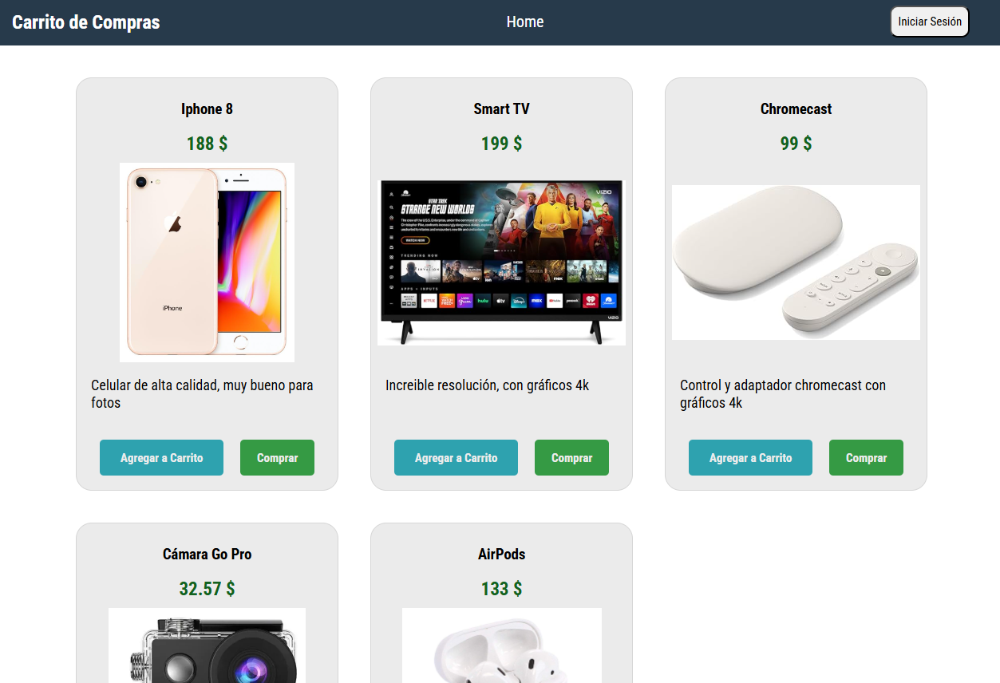

# Carrito de Compras - Proyecto UNEWEB

> This project displays a page of shopping cart using php and css for Frotend and MySQL for Backend.
> 

    

## Built With

- PHP
- CSS
- MySQL

## Live Demo

[Link del despliegue](http://elloquius-001-site1.ltempurl.com/)

## Getting Started

To get a local copy up and running follow these simple example steps.

### Prerequisites

Have git installed on your PC, a code editor like VSCode, the php programming language and mysql, as well as a page viewer on localhost like xampp 

### Install

Clone this repository on your local machine into the htdocs folder of your xampp folder
previously installed on your local disk

### Usage

In your internet browser, type "localhost/phpmyadmin" after starting xampp, then create a database and copy and paste the entire contents of the "bdcarritocompras.sql" file that is in the "database" folder, in the sql tab and execute the query. Then type in your search engine "localhost/proyecto-uneweb" or the name you have given to your cloned folder and press enter. With this you can see the shopping cart.

## Authors

👤 **ELLOQUIUS**

- GitHub: [@elloquius](https://github.com/ELLOQUIUS)

## Show your support

Give a ⭐️ if you like this project!

## Acknowledgments

- Uneweb (https://www.uneweb.edu.ve/)
- 👤 **aristides1000**   GitHub: [@aristides1000](https://github.com/aristides1000)
